## Description of our project

## Steps

# 1.Git Installation
**The installation of Git and the verification of the installed Git version.**

# 2.Git Configuration
**Configures the Git username and email address used to identify commits.**

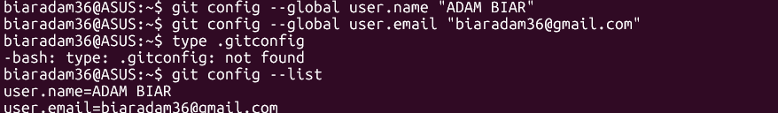

# 3.Git Repository Initialization
**How to create a project directory and initialize it as a Git repository.**

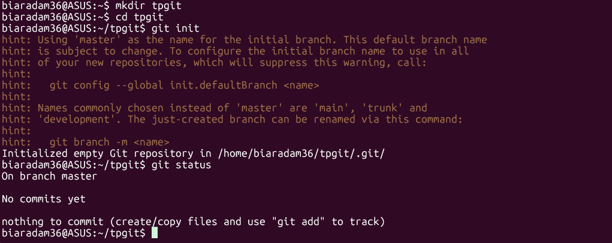

# 4.Git Branches
**Create and work with different branches such as master, vegetables and sauces.**

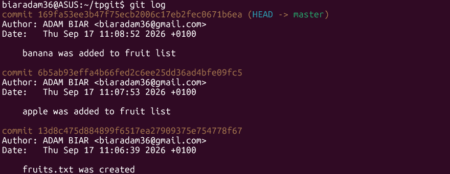

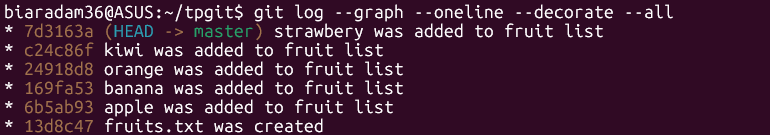

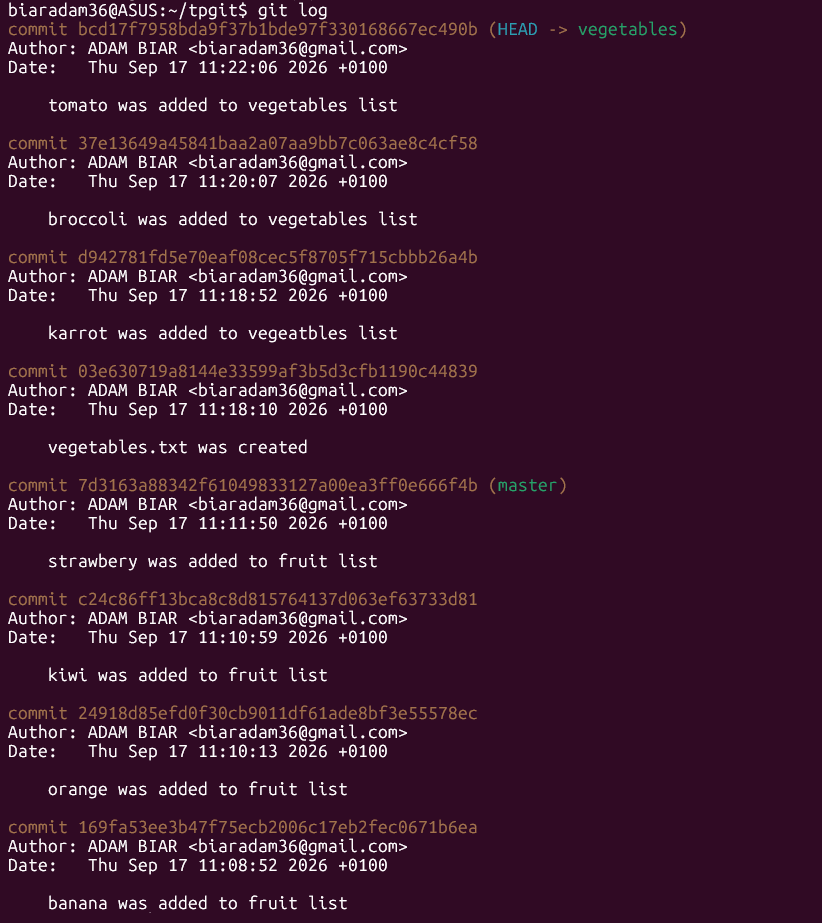

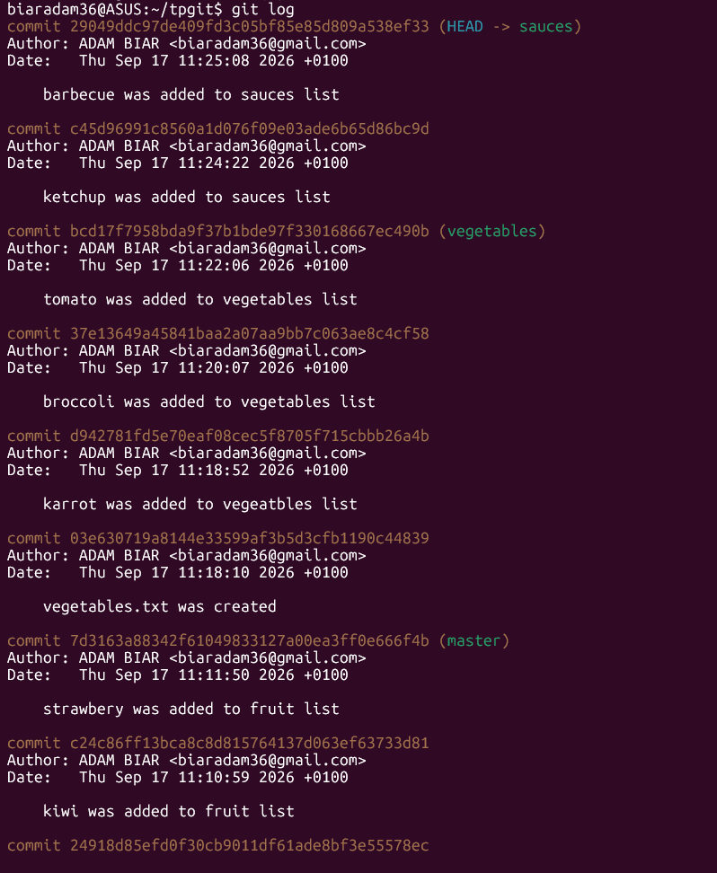

# 5.Git Merges
**How changes from different branches can be merged into the master branch.**

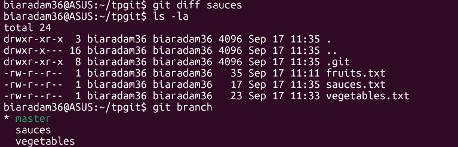

# 6.Remote Repository
**How to create a GitHub repository and connect the local project to it.**

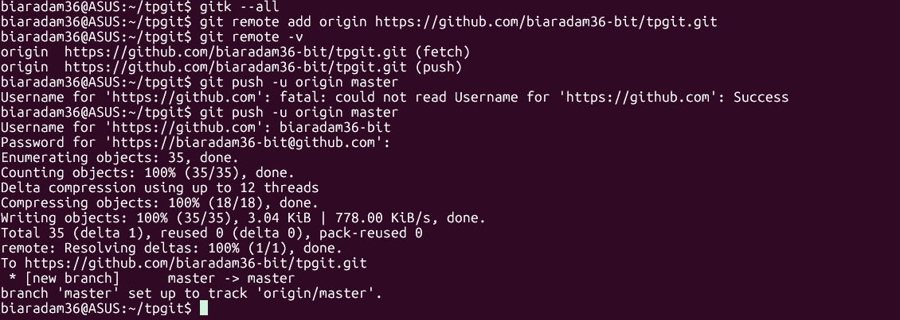

# 7.Collaborative Work
**How team members can work on the same GitHub project and collaborate through remote repositories.**

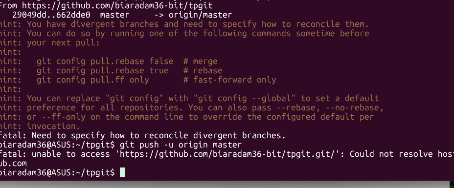

# 8.Merge without conflict
**Two contributors can make changes and merge their work without creating conflicts.**

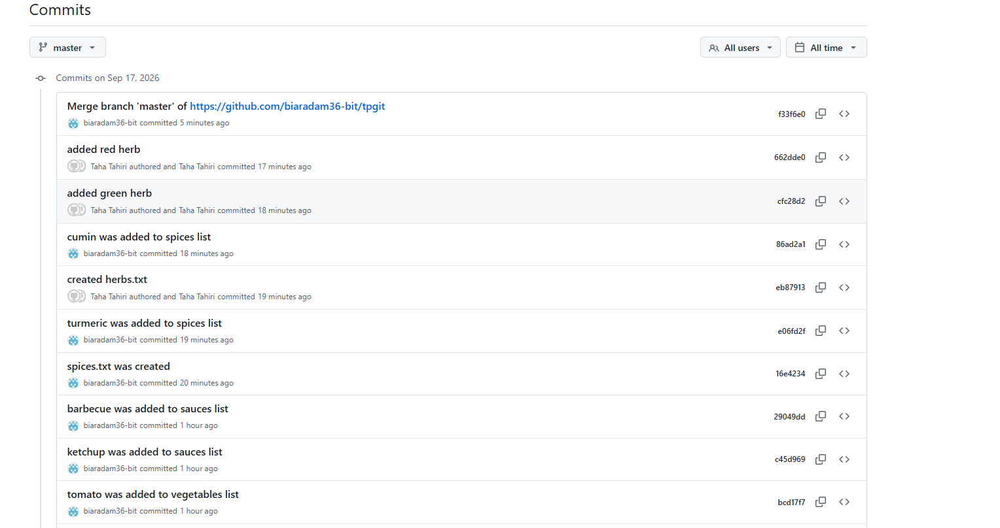

# 9.Merge with conflict
**Git detects conflicting changes and how the conflict can be resolved before completing the merge.**

**First conflict:**

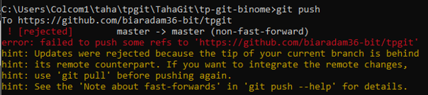

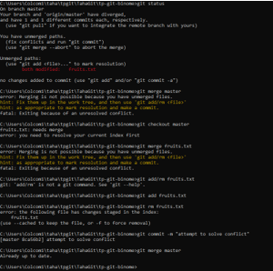

**Second conflict:**

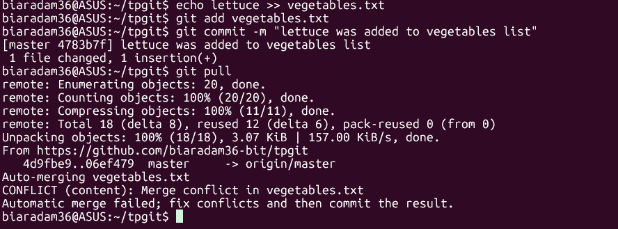

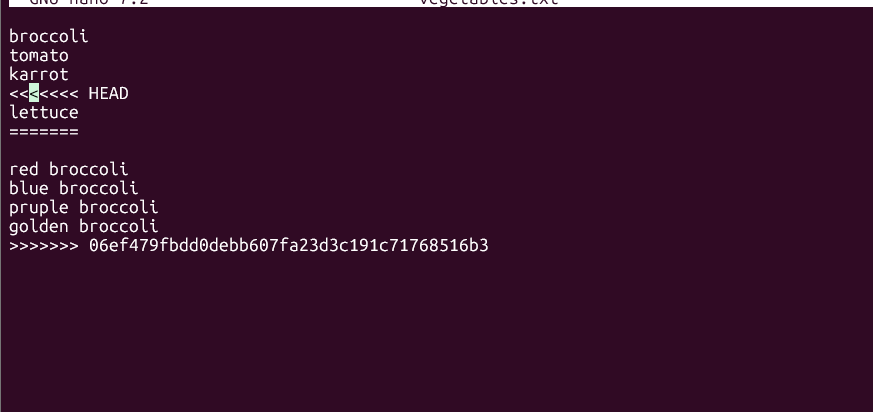

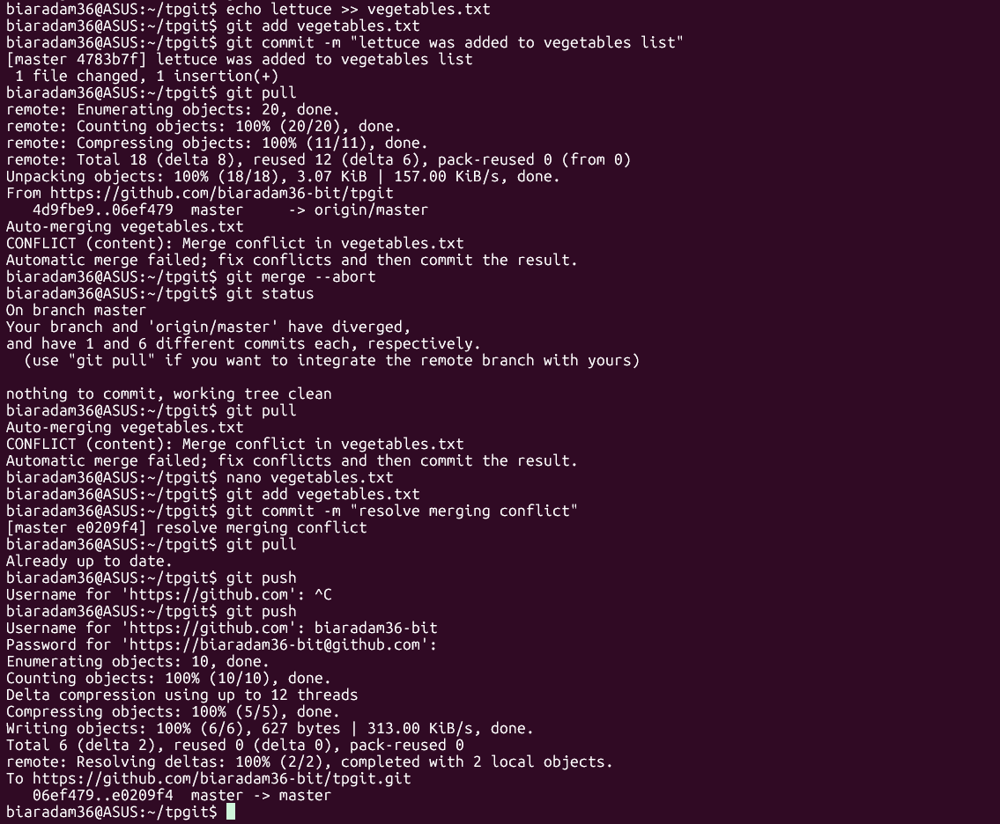

## Authors
* **BIAR ADAM**
* **ALAOUI TAHIRI TAHA**

## Objectives
* Learn how to use Git/GitHub to manage and track all the modifications of our project.
* Learn how to use a version control software by understanding git commands such as **init**, **status**, **add**, **commit**, **pull**, **push**, **branch**, **merge**.
* Develop collaboration skills by working with other students on the same project.
* Learn how to manage commits and branches.
* Learn how to handle merge conflicts when different team members modify the same files.
  

